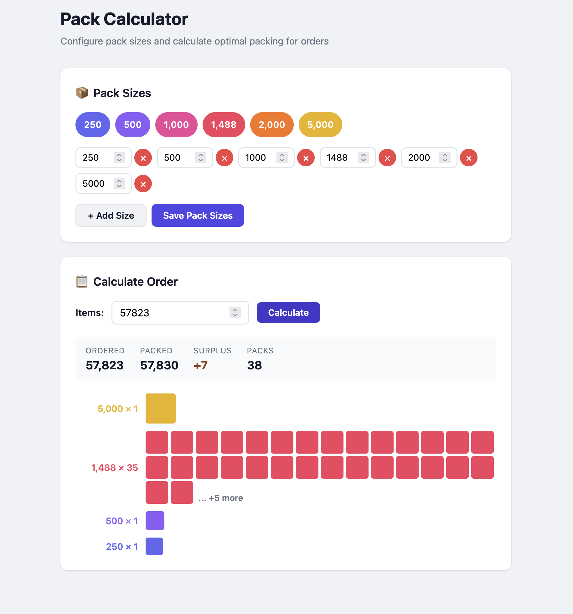
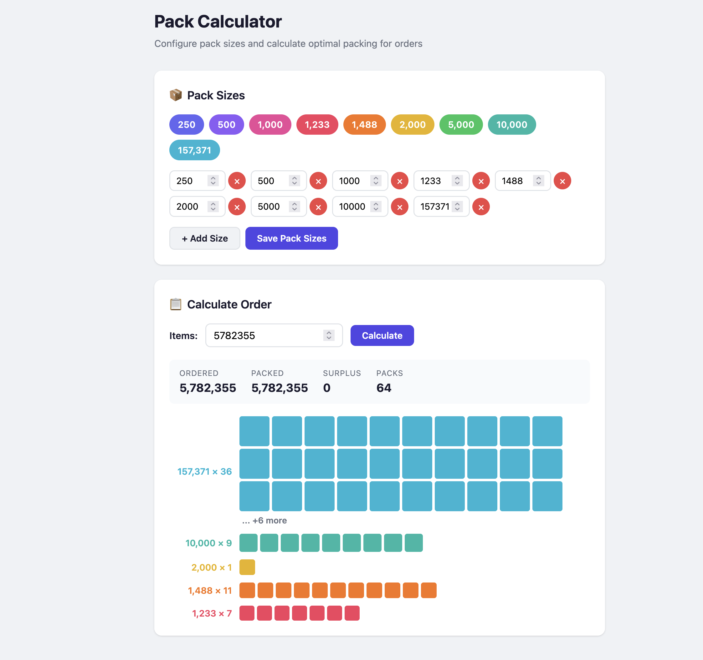

# About

This is my attempt to solve [coding challenge](doc/assignment.pdf)

This Readme only has a brief description on what it is and how to run it. To see my investigation check [research](doc/RESEARCH.md)

# Some screenshots

# Limits

I decided to introduce some limits not to overwhelm the server

| Parameter      | Limit                      |
| -------------- | -------------------------- |
| Items ordered  | 1 – 1,000,000,000          |
| Pack size      | 1 – 1,000,000              |
| Distinct packs | 1 – 20                     |
| DP table cap   | 1,000,000 entries (~24 MB) |

# Quick start (`docker` and `docker compose` required)

- `docker compose up -d --build`
- Go to `localhost:8080`
- Test yourself. Also open in several tabs and try to modify packs / calculate concurrently

# Test locally (`go 1.26.2` installed required)

> default port is `8080` and file will be created in this repo at `data` folder

- runs server natively    - `go run cmd/server/main.go`
- override default values - `ADDR=:8080 PACK_FILE=data/packs.json go run cmd/server/main.go`
- unit tests              - `go test ./...`

# Curl commands (if want to test endpoint manually):

- Get current packs - `curl -s localhost:8080/api/v1/packs | jq`
- Set custom packs  - `curl -s -X POST localhost:8080/api/v1/packs -d '{"packs": [23, 31, 53]}' | jq`
- Calculate         - `curl -s -X POST localhost:8080/api/v1/calculate -d '{"items": 1}' | jq`
- Reset packs       - `curl -s -X POST localhost:8080/api/v1/packs -d '{"packs": [250, 500, 1000, 2000, 5000]}' | jq`

# Finish

When done with experiments - `docker compose down -v`
